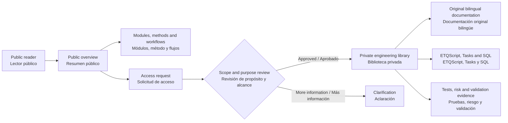
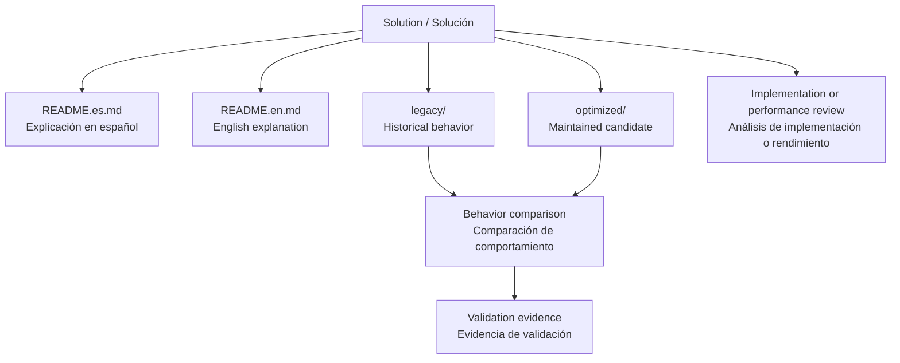
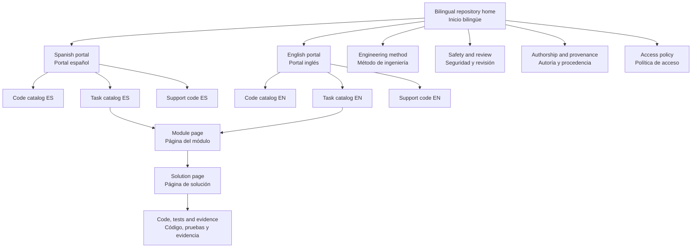
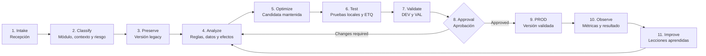
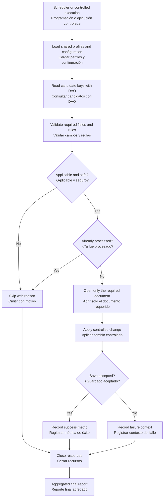
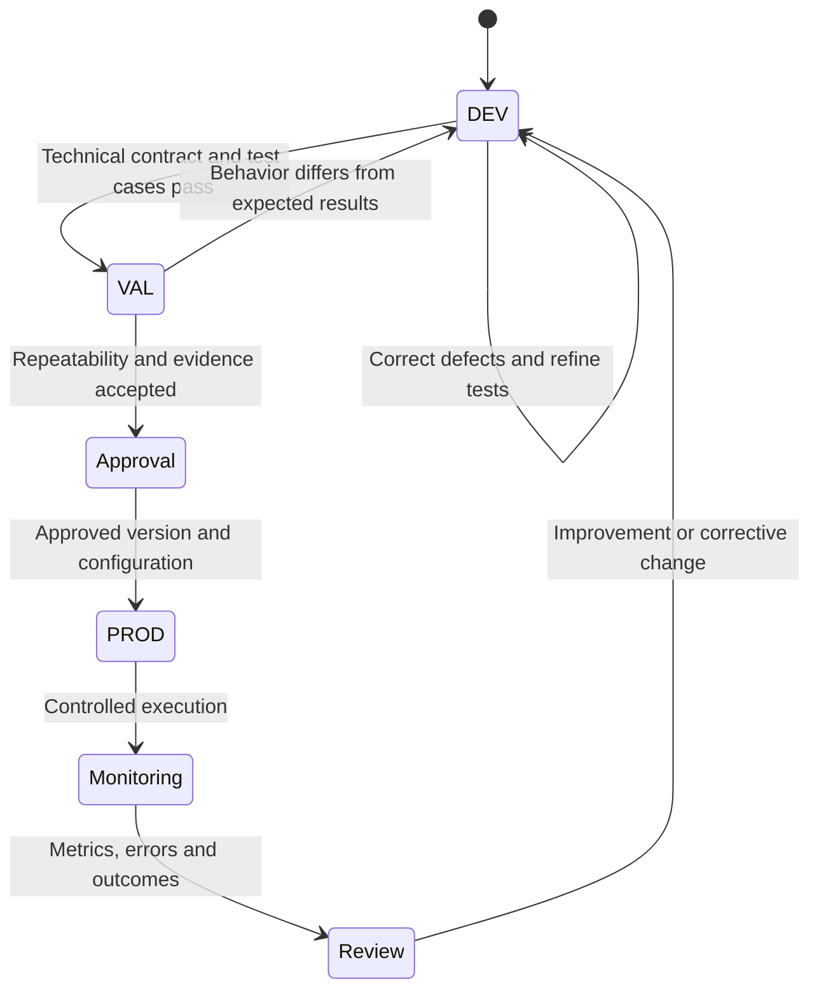
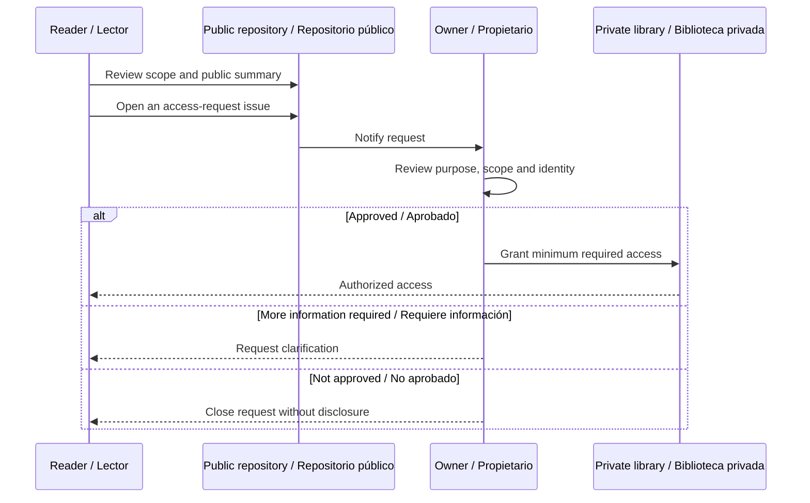

# ETQ Reliance Automation Engineering


> **ES:** Una biblioteca de ingeniería para convertir automatizaciones ETQ Reliance en soluciones seguras, explicables, observables y mantenibles.
>
> **EN:** An engineering library for turning ETQ Reliance automations into safe, explainable, observable, and maintainable solutions.

[Resumen](#-resumen--overview) · [Arquitectura](#-arquitectura-del-proyecto--project-architecture) · [Módulos](#-módulos-y-soluciones--modules-and-solutions) · [Páginas](#-mapa-de-documentación--documentation-map) · [Flujos](#-flujos-de-trabajo--workflows) · [Acceso](#-solicitar-acceso--request-access)

---

## 🎯 Resumen / Overview

### Español

Este proyecto independiente organiza conocimiento práctico sobre ETQ Reliance en una biblioteca bilingüe de código y documentación. Reúne fórmulas ETQScript/Jython, EtQScript Profiles reutilizables, Task Profiles, consultas SQL Server y procedimientos de validación para ambientes DEV, VAL y PROD.

La biblioteca privada no es un simple depósito de scripts. Cada solución busca responder preguntas operativas concretas:

- ¿Qué problema resuelve?
- ¿Cuándo y desde qué contexto se ejecuta?
- ¿Qué datos consulta, crea o modifica?
- ¿Qué reglas de negocio debe preservar?
- ¿Cuáles son sus riesgos y controles?
- ¿Cómo se compara la versión `legacy` con la versión `optimized`?
- ¿Qué métricas y logs permiten demostrar el resultado?
- ¿Cómo se valida, promueve y recupera la solución?

### English

This independent project organizes practical ETQ Reliance knowledge into a bilingual code and documentation library. It covers ETQScript/Jython formulas, reusable EtQScript Profiles, Task Profiles, SQL Server queries, and validation practices across DEV, VAL, and PROD.

The private library is more than a script archive. Each solution explains its purpose, execution context, data effects, business rules, risks, controls, legacy-versus-optimized differences, expected metrics, validation path, and recovery strategy.

### La biblioteca en números / Library at a glance

| Elemento / Item | Inventario actual / Current inventory |
| --- | ---: |
| Archivos controlados / Tracked files | **399** |
| Documentos Markdown / Markdown documents | **331** |
| Archivos ETQScript/Python / ETQScript-Python files | **46** |
| Consultas SQL / SQL queries | **21** |
| Módulos de Tasks / Task modules | **5** |
| Soluciones Task clasificadas / Classified Task solutions | **20** |
| EtQScript Profiles documentados / Documented EtQScript Profiles | **7** |
| Grupos de eventos de formulario / Form-event groups | **4** |

> Las cifras describen la biblioteca privada en su estado actual. No significan que todos los componentes estén aprobados para producción.
>
> These figures describe the current private library. They do not imply that every component is approved for production.

---

## 🧭 Arquitectura del proyecto / Project architecture

La portada pública explica el proyecto sin exponer implementación interna. El código, las decisiones técnicas y la documentación detallada permanecen en un repositorio privado con acceso controlado.

The public portal explains the project without exposing internal implementation. Source code, engineering decisions, and detailed documentation remain in a controlled private repository.



### Estructura interna resumida / Internal structure summary

```text
private-library/
├── README.md                         Entrada bilingüe / Bilingual entry point
├── docs/                             Catálogos, método, acceso y procedencia
├── library/
│   ├── etqscript/
│   │   ├── formulas/                 Fórmulas pequeñas por intención
│   │   ├── forms/                    On Open, On Refresh, On Save y Shared
│   │   ├── profiles/                 Utilidades reutilizables
│   │   └── tasks/modules/            Tasks agrupados por módulo ETQ
│   └── sql/                          Administración, configuración y diagnóstico
├── tools/                            Validación de inventario y documentación
└── archive/                          Evidencia local excluida de publicación
```

### Organización de cada solución / Per-solution organization



| Área | Qué significa |
| --- | --- |
| `legacy/` | Conserva la fuente recibida o el comportamiento histórico para comparación y recuperación. |
| `optimized/` | Contiene una candidata mantenida, una prueba controlada o un plan de mejora. No implica aprobación para PROD. |
| `README.es.md` | Propósito, funcionamiento, configuración, efectos, riesgos y validación en español. |
| `README.en.md` | The same technical explanation in English. |
| `IMPLEMENTATION.*.md` | Decisiones de diseño, compatibilidad, cambios deliberados y criterios de aceptación. |
| `PERFORMANCE_REVIEW.md` | Cuellos de botella, volumen, métricas, estrategia de medición y comparación. |

---

## 🧩 Módulos y soluciones / Modules and solutions

### Training Management — 10 soluciones / solutions

| Solución / Solution | Resumen público / Public summary |
| --- | --- |
| Auto Create Training Assignments | Crea asignaciones según aplicabilidad, fuente, revisión, recurrencia y prevención de duplicados. |
| Check In Course Profiles | Revisa y registra Course Profiles mediante un proceso controlado. |
| Disable Course Profiles | Deshabilita perfiles que cumplen criterios administrativos definidos. |
| Disable Profiles with Source Documents | Evalúa la relación con documentos fuente antes de deshabilitar perfiles. |
| Notify Expired Assignments | Detecta asignaciones vencidas y genera notificaciones controladas. |
| Refresh Completed Assignments | Actualiza asignaciones completadas según reglas temporales y de recurrencia. |
| Role-Based Training Sync | Sincroniza grupos de capacitación con roles y alcance organizacional configurado. |
| Single Course Assignment Test | Permite validar la creación de asignaciones con un Course Profile acotado. |
| Void Non-applicable Assignments | Identifica y anula asignaciones que dejaron de ser aplicables. |
| Void Recent Assignments | Proporciona un mecanismo de recuperación para asignaciones creadas recientemente. |

### Document Control — 5 soluciones / solutions

| Solución / Solution | Resumen público / Public summary |
| --- | --- |
| Bulk Archive | Procesa archivo documental por lotes con controles de selección y resultado. |
| Hard Copy Distribution List | Mantiene información de distribución física asociada al ciclo documental. |
| Legacy Hardcopy Migration | Migra información histórica hacia una estructura nueva con prevención de duplicados. |
| Rename Documents | Ejecuta cambios controlados de nombre sobre documentos seleccionados. |
| Void Overdue Draft Documents | Identifica borradores vencidos y documenta una estrategia de anulación o reporte. |

### Administration Center — 2 soluciones / solutions

| Solución / Solution | Resumen público / Public summary |
| --- | --- |
| Expiration Date Reminder | Evalúa fechas de expiración y prepara recordatorios administrativos. |
| Release System Locks | Identifica y libera bloqueos documentales administrados por el sistema. |

### Shared Workflow — 2 soluciones / solutions

| Solución / Solution | Resumen público / Public summary |
| --- | --- |
| Auto-void Orphaned Action Items | Detecta Action Items sin relación válida y aplica un tratamiento controlado. |
| Route Documents | Encapsula reglas para enrutar documentos dentro del workflow configurado. |

### Compliance Obligations — 1 solución / solution

| Solución / Solution | Resumen público / Public summary |
| --- | --- |
| Regulatory Integration Task | Organiza el flujo de una integración externa relacionada con obligaciones regulatorias. |

---

## 🧰 Componentes reutilizables / Reusable components

### EtQScript Profiles

| Perfil / Profile | Responsabilidad / Responsibility |
| --- | --- |
| Global Script Utilities | Logging, contratos, fechas, campos, DAO, SQL seguro, subforms, attachments, links, creación, guardado y runners. |
| Training Management Utility Functions | Funciones compartidas para Course Profiles, empleados, aplicabilidad y Training Assignments. |
| Email Helpers | Construcción y envío consistente de correos desde automatizaciones ETQ. |
| ETQ Debug | Utilidades de diagnóstico y representación controlada de objetos. |
| CURR Sync Helpers | Funciones auxiliares para procesos de sincronización especializados. |
| Sustainability Data Collection | Utilidades para crear y mantener registros de recopilación de datos. |
| Sustainability Definitions | Definiciones compartidas utilizadas por el perfil de recopilación. |

### Formulas y eventos / Formulas and events

- Cálculo de diferencias en días hábiles.
- Validación de ubicaciones seleccionadas.
- Control de acceso a secciones por ubicación y fase.
- Creación y reasignación de Action Items.
- Movimiento de registros dentro de subformularios.
- Fórmulas de Course Profile para `On Open`, `On Refresh`, `On Save` y contexto compartido.

### SQL Server — 21 consultas / queries

| Categoría / Category | Cobertura / Coverage |
| --- | --- |
| Administración | Accesos por ambiente, usuarios, grupos, membresías, perfiles, ubicaciones y zonas horarias. |
| Configuración | Campos, lookups, sincronización, listas maestras, búsqueda de referencias y workflows. |
| Documentos | Rutas y relaciones de attachments documentales. |
| Diagnóstico | Conteos, comprobaciones de volumen y consultas read-only previas a cambios. |
| SQL asociado a Tasks | Data sources y diagnósticos que forman parte de una automatización específica. |

---

## 📚 Mapa de documentación / Documentation map

La biblioteca privada contiene distintos niveles de lectura para que una persona pueda empezar por el resumen y llegar gradualmente a la implementación.

The private library provides multiple reading levels, allowing a reader to move from a high-level summary to implementation details.



| Página privada / Private page | Qué encontrará el lector / What the reader will find |
| --- | --- |
| Portal ES / EN | Navegación recomendada según idioma y tipo de necesidad. |
| Code Catalog ES / EN | Propósito, funcionamiento, configuración, efectos y riesgo de `.py` y `.sql`. |
| Task Profiles ES / EN | Inventario de Tasks organizado por módulo y objetivo operativo. |
| Support Code ES / EN | Fórmulas, perfiles reutilizables y herramientas de mantenimiento. |
| Engineering Method ES / EN | Proceso para clasificar, preservar, analizar, optimizar, probar y promover. |
| Safety and Review | Checklist antes de guardar, enrutar, anular, archivar o modificar registros. |
| Authorship and Provenance ES / EN | Diferencia entre documentación propia, código optimizado, legacy y fuentes externas. |
| Access Policy ES / EN | Solicitud, evaluación, alcance mínimo y retiro de acceso. |
| API and Implementation Notes | Contratos de utilidades, decisiones técnicas y compatibilidad esperada. |
| Performance Reviews | Consultas dominantes, puntos de medición, volumen y criterios de aceptación. |

---

## 🔄 Flujos de trabajo / Workflows

### 1. Ciclo de ingeniería / Engineering lifecycle



### 2. Flujo típico de un Task / Typical Task flow



### 3. Promoción DEV → VAL → PROD



| Ambiente / Environment | Objetivo / Objective | Evidencia mínima / Minimum evidence |
| --- | --- | --- |
| DEV | Confirmar contrato técnico, reglas y manejo de errores. | Casos positivos, negativos, límites y logs. |
| VAL | Demostrar repetibilidad con configuración equivalente. | Comparación con legacy, resultados esperados y aprobación. |
| PROD | Ejecutar exactamente la versión aprobada. | Versión, parámetros, inicio/fin, métricas, excepciones y resultado. |

### 4. Acceso a la documentación / Documentation access



---

## 🔬 Casos de estudio representativos / Representative case studies

### Auto Create Training Assignments

Una automatización de alto volumen utilizada para estudiar aplicabilidad, prevención de duplicados por fuente y revisión, consultas en bloque, límites de listas SQL, apertura tardía de documentos y métricas de rendimiento.

A high-volume automation used to study applicability, source-and-revision duplicate prevention, bulk queries, bounded SQL lists, late document opening, and performance metrics.

### Global Script Utilities

Un EtQScript Profile centralizado para estandarizar logging, validaciones, fechas, acceso a campos, DAO, SQL de solo lectura, subformularios, attachments, links, creación documental, guardado y cierre seguro.

A centralized EtQScript Profile for standardizing logging, validation, dates, fields, DAO access, read-only SQL, subforms, attachments, links, document creation, saving, and reliable cleanup.

### Role-Based Training Sync

Un patrón de sincronización que combina pertenencia a grupos, alcance por ubicación, actualización aditiva e idempotencia para evitar reemplazos innecesarios de campos multivalor.

A synchronization pattern combining group membership, location scope, additive updates, and idempotency to avoid unnecessary replacement of multi-value fields.

### Legacy Hardcopy Migration

Un ejemplo de migración controlada con selección DAO-first, detección de duplicados, validación previa a creación, métricas por etapa y planificación de recuperación.

A controlled migration example using DAO-first selection, duplicate detection, pre-create validation, stage metrics, and recovery planning.

---

## ✅ Principios de ingeniería / Engineering principles

| Principio / Principle | Aplicación / Application |
| --- | --- |
| Idempotencia / Idempotency | Repetir una ejecución no debe crear duplicados ni degradar datos. |
| Fail closed | Si una validación crítica no puede completarse, no se realiza el cambio. |
| DAO-first | Primero se seleccionan claves y candidatos; después se abren solo los documentos necesarios. |
| Recursos acotados / Bounded resources | Se limitan volumen, listas `IN`, materialización de filas y frecuencia de logs. |
| Observabilidad / Observability | Se registran contadores, tiempos, motivos de omisión y errores accionables. |
| Cierre garantizado / Guaranteed cleanup | Los documentos abiertos se cierran incluso cuando ocurre una excepción. |
| Configuración explícita / Explicit configuration | IDs, nombres de diseño, límites y opciones dependientes del ambiente se identifican claramente. |
| Evidencia antes de PROD / Evidence before PROD | Una optimización no se promueve solo porque compila o parece más rápida. |

### Qué significa “optimized” / What “optimized” means

Una versión `optimized` intenta mejorar rendimiento, claridad, seguridad u observabilidad preservando el comportamiento esperado. Sigue siendo una candidata hasta completar pruebas y aprobación.

An `optimized` version attempts to improve performance, clarity, safety, or observability while preserving expected behavior. It remains a candidate until testing and approval are complete.

---

## ✍️ Autoría y límites / Authorship and boundaries

### Trabajo original / Original work

Son trabajo técnico y editorial propio del proyecto:

- la arquitectura y organización por módulos;
- las explicaciones funcionales bilingües;
- los análisis de riesgo y efectos;
- las comparaciones `legacy` versus `optimized`;
- las propuestas de rendimiento y observabilidad;
- los planes de prueba, criterios de aceptación y guías de recuperación.

The repository architecture, module organization, bilingual functional explanations, risk analysis, legacy-versus-optimized comparisons, performance proposals, test plans, acceptance criteria, and recovery guidance are original project work.

### Límites / Boundaries

- Esta portada no contiene código privado ni configuración interna.
- Los manuales del proveedor no se publican ni se presentan como contenido propio.
- El código histórico externo se identifica como `legacy` y conserva su procedencia.
- No se publican datos personales, credenciales, rutas internas ni información de producción.
- Ningún contenido sustituye la documentación, capacitación, licencia o soporte oficial del proveedor.

- This overview contains no private source code or internal configuration.
- Vendor manuals are neither published nor presented as original work.
- External historical code is identified as `legacy` and retains its provenance.
- Personal data, credentials, internal paths, and production information are not published.
- Nothing here replaces official vendor documentation, training, licensing, or support.

---

## 🔐 Solicitar acceso / Request access

La biblioteca completa es privada. El acceso se evalúa individualmente y se concede con el alcance mínimo necesario.

The complete library is private. Access is reviewed individually and granted with the minimum required scope.

### Información requerida / Required information

1. Usuario de GitHub / GitHub username.
2. Propósito de la solicitud / Purpose of the request.
3. Módulo o tema requerido / Required module or topic.
4. Uso previsto de la información / Intended use of the information.
5. Confirmación de que no se redistribuirá contenido restringido / Confirmation that restricted content will not be redistributed.

### Crear solicitud / Create request

[**Abrir un issue de solicitud de acceso / Open an access-request issue →**](https://github.com/yorzethmc/etq-reliance-automation-overview/issues/new)

> No incluya información confidencial, datos personales, configuraciones internas ni detalles de producción en un issue público.
>
> Do not include confidential information, personal data, internal configuration, or production details in a public issue.

---

## Independence notice

ETQ, ETQ Reliance, and Octave Reliance are names and trademarks of their respective owners. This independent project is not affiliated with, endorsed by, or a replacement for the vendor's official documentation, training, licensing, or support.
