# ETQ Reliance Automation Engineering


[English](#english) · [Español](#español)

---

# English

> An engineering library for turning ETQ Reliance automations into safe, explainable, observable, and maintainable solutions.

[Overview](#overview) · [Architecture](#project-architecture) · [Modules](#modules-and-solutions) · [Documentation](#documentation-map) · [Workflows](#workflows) · [Request access](#request-access)

## Overview

This independent project organizes practical ETQ Reliance knowledge into a structured engineering library. It covers ETQScript/Jython formulas, reusable EtQScript Profiles, scheduled Task Profiles, SQL Server queries, and validation practices across DEV, VAL, and PROD.

The private library is more than a script archive. Every solution is documented to answer these questions:

- What operational problem does it solve?
- When and from which ETQ context does it run?
- What information does it read, create, or modify?
- Which business rules must remain unchanged?
- What are the risks and required controls?
- How does the `legacy` implementation differ from the `optimized` candidate?
- Which metrics and logs demonstrate the result?
- How should the solution be tested, promoted, and recovered?

## Library at a glance

| Item | Current inventory |
| --- | ---: |
| Tracked files | **399** |
| Markdown documents | **331** |
| ETQScript/Python files | **46** |
| SQL queries | **21** |
| Task modules | **5** |
| Classified Task solutions | **20** |
| Documented EtQScript Profiles | **7** |
| Form-event groups | **4** |

> These figures describe the current private library. They do not imply that every component is approved for production.

## Project architecture

The public repository explains the project without exposing internal implementation. Source code, design decisions, test evidence, and detailed documentation remain in a controlled private repository.

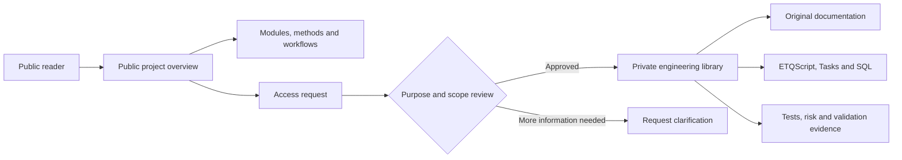

### Internal repository structure

```text
private-library/
├── README.md                         Main repository entry point
├── docs/                             Catalogs, method, access and provenance
├── library/
│   ├── etqscript/
│   │   ├── formulas/                 Small formulas grouped by purpose
│   │   ├── forms/                    On Open, On Refresh, On Save and Shared
│   │   ├── profiles/                 Reusable utility profiles
│   │   └── tasks/modules/            Tasks grouped by ETQ module
│   └── sql/                          Administration, configuration and diagnostics
├── tools/                            Inventory and documentation validation
└── archive/                          Local evidence excluded from publication
```

### Per-solution organization

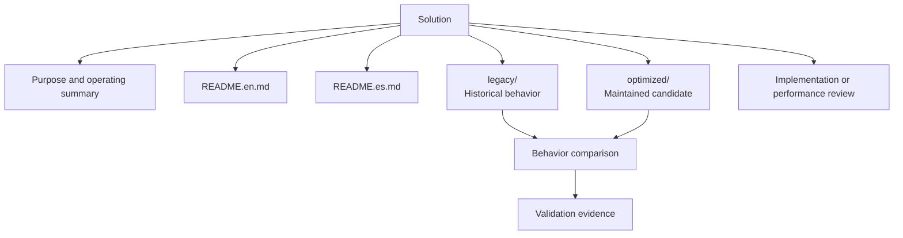

| Area | Meaning |
| --- | --- |
| `legacy/` | Preserves received source or historical behavior for comparison and recovery. |
| `optimized/` | Contains a maintained candidate, controlled test, or improvement plan. It does not imply production approval. |
| `README.en.md` | Explains purpose, behavior, configuration, effects, risks, and validation in English. |
| `README.es.md` | Provides the corresponding Spanish explanation. |
| `IMPLEMENTATION.*.md` | Records design decisions, compatibility constraints, deliberate changes, and acceptance criteria. |
| `PERFORMANCE_REVIEW.md` | Documents bottlenecks, data volume, measurement points, and performance expectations. |

## Modules and solutions

### Training Management — 10 solutions

| Solution | Public summary |
| --- | --- |
| Auto Create Training Assignments | Creates assignments using applicability, source, revision, recurrence, and duplicate-prevention rules. |
| Check In Course Profiles | Reviews and checks in Course Profiles through a controlled process. |
| Disable Course Profiles | Disables profiles that meet defined administrative criteria. |
| Disable Profiles with Source Documents | Evaluates source-document relationships before disabling profiles. |
| Notify Expired Assignments | Detects expired assignments and produces controlled notifications. |
| Refresh Completed Assignments | Refreshes completed assignments according to recurrence and date rules. |
| Role-Based Training Sync | Synchronizes training groups using configured roles and organizational scope. |
| Single Course Assignment Test | Supports bounded validation against one Course Profile. |
| Void Non-applicable Assignments | Identifies and voids assignments that are no longer applicable. |
| Void Recent Assignments | Provides a recovery mechanism for recently created assignments. |

### Document Control — 5 solutions

| Solution | Public summary |
| --- | --- |
| Bulk Archive | Processes document archiving in batches with controlled selection and reporting. |
| Hard Copy Distribution List | Maintains physical-distribution information throughout the document lifecycle. |
| Legacy Hardcopy Migration | Migrates historical distribution information with duplicate prevention and recovery planning. |
| Rename Documents | Applies controlled name changes to selected documents. |
| Void Overdue Draft Documents | Identifies overdue drafts and defines a controlled reporting or voiding strategy. |

### Administration Center — 2 solutions

| Solution | Public summary |
| --- | --- |
| Expiration Date Reminder | Evaluates expiration dates and prepares administrative reminders. |
| Release System Locks | Identifies and releases document locks managed by the system. |

### Shared Workflow — 2 solutions

| Solution | Public summary |
| --- | --- |
| Auto-void Orphaned Action Items | Detects Action Items without a valid parent relationship and applies controlled handling. |
| Route Documents | Encapsulates rules for routing documents through configured workflows. |

### Compliance Obligations — 1 solution

| Solution | Public summary |
| --- | --- |
| Regulatory Integration Task | Organizes an external-integration flow related to regulatory obligations. |

## Reusable components

### EtQScript Profiles

| Profile | Responsibility |
| --- | --- |
| Global Script Utilities | Logging, contracts, dates, fields, DAO, guarded SQL, subforms, attachments, links, document creation, saving, and runners. |
| Training Management Utility Functions | Shared operations for Course Profiles, employees, applicability, and Training Assignments. |
| Email Helpers | Consistent email construction and delivery from ETQ automations. |
| ETQ Debug | Controlled diagnostics and object representation. |
| CURR Sync Helpers | Supporting functions for specialized synchronization processes. |
| Sustainability Data Collection | Utilities for creating and maintaining data-collection records. |
| Sustainability Definitions | Shared definitions consumed by the data-collection profile. |

### Formulas and form events

- Business-day difference calculations.
- Selected-location validation.
- Section access based on location and workflow phase.
- Action Item creation and reassignment.
- Subform record movement.
- Course Profile formulas for `On Open`, `On Refresh`, `On Save`, and shared context.

### SQL Server — 21 queries

| Category | Coverage |
| --- | --- |
| Administration | Environment access, users, groups, memberships, profiles, locations, and time zones. |
| Configuration | Fields, lookups, synchronization, master lists, reference searches, and workflows. |
| Documents | Document attachment paths and relationships. |
| Diagnostics | Row counts, volume checks, and read-only analysis before changes. |
| Task-specific SQL | Data sources and diagnostics that support a specific automation. |

## Documentation map

The private library provides multiple reading levels. A reader can begin with the repository overview and move gradually toward module, solution, and implementation detail.

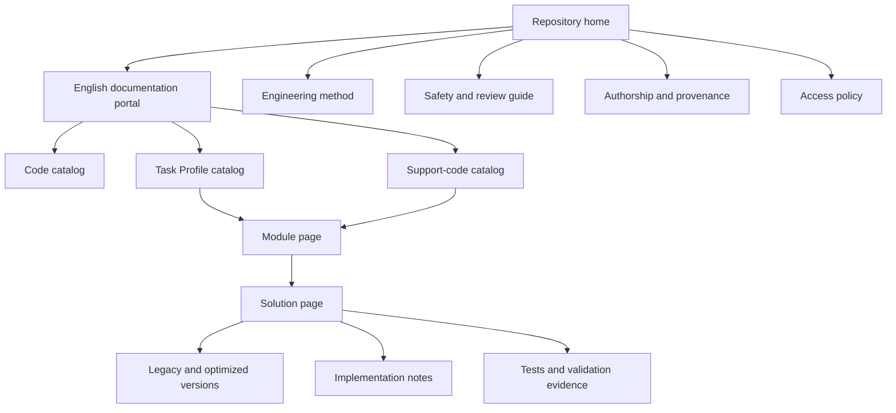

| Private page | What the reader will find |
| --- | --- |
| English documentation portal | Recommended navigation by need and content type. |
| English code catalog | Purpose, operation, configuration, effects, and risk for Python and SQL sources. |
| English Task Profile catalog | Task inventory organized by ETQ module and operational objective. |
| English support-code catalog | Formulas, reusable profiles, and maintenance tools. |
| Engineering method | The process used to classify, preserve, analyze, optimize, test, and promote solutions. |
| Safety and review guide | Review checklist before saving, routing, voiding, archiving, or changing records. |
| Authorship and provenance | Separation between original documentation, optimized work, legacy sources, and external material. |
| Access policy | Request requirements, review, minimum scope, and access removal. |
| API and implementation notes | Utility contracts, technical decisions, and expected compatibility. |
| Performance reviews | Dominant queries, measurement points, volume controls, and acceptance criteria. |

## Workflows

### Engineering lifecycle

```mermaid
flowchart LR
    Intake["1. Receive source or requirement"] --> Classify["2. Classify module, context and risk"]
    Classify --> Preserve["3. Preserve legacy behavior"]
    Preserve --> Analyze["4. Analyze rules, data and effects"]
    Analyze --> Optimize["5. Design maintained candidate"]
    Optimize --> Test["6. Run local and ETQ tests"]
    Test --> Validate["7. Validate in DEV and VAL"]
    Validate --> Approve{"8. Approval"}
    Approve -->|Approved| Deploy["9. Promote validated version to PROD"]
    Approve -->|Changes required| Analyze
    Deploy --> Observe["10. Observe metrics and outcome"]
    Observe --> Improve["11. Capture lessons and improvements"]
    Improve --> Analyze
```

### Typical Task execution

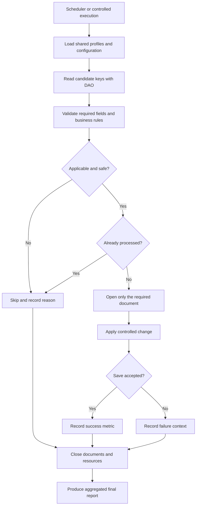

### DEV to VAL to PROD promotion

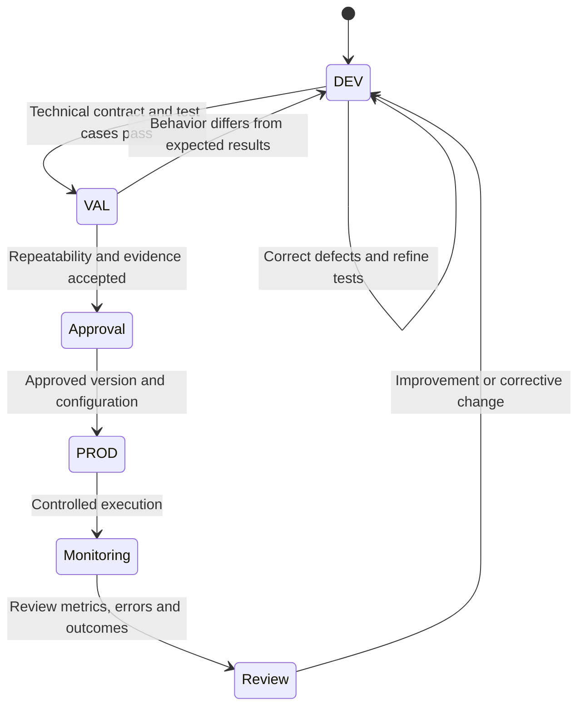

| Environment | Objective | Minimum evidence |
| --- | --- | --- |
| DEV | Confirm the technical contract, business rules, and error handling. | Positive, negative, boundary, failure, and logging cases. |
| VAL | Demonstrate repeatability with equivalent configuration. | Legacy comparison, expected results, and approval. |
| PROD | Run the exact approved version under operating controls. | Version, parameters, start/end, metrics, exceptions, and final result. |

### Documentation access workflow

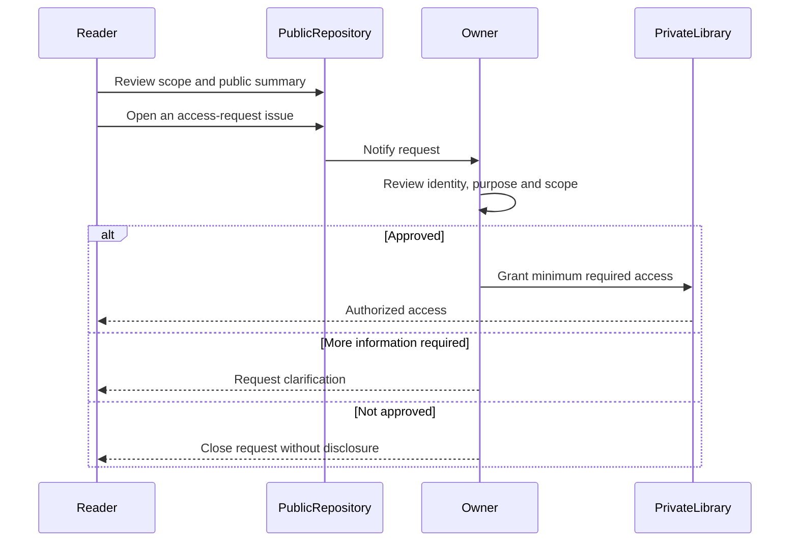

## Representative case studies

### Auto Create Training Assignments

A high-volume automation used to study applicability, source-and-revision duplicate prevention, bulk queries, bounded SQL lists, late document opening, and performance metrics.

### Global Script Utilities

A centralized EtQScript Profile for standardizing logging, validation, dates, field access, DAO operations, guarded SQL, subforms, attachments, links, document creation, saving, and reliable cleanup.

### Role-Based Training Sync

A synchronization pattern combining group membership, location scope, additive updates, and idempotency to avoid unnecessary replacement of multi-value fields.

### Legacy Hardcopy Migration

A controlled migration example using DAO-first selection, duplicate detection, pre-create validation, stage metrics, and recovery planning.

## Engineering principles

| Principle | Application |
| --- | --- |
| Idempotency | Repeating an execution should not create duplicates or degrade data. |
| Fail closed | If a critical validation cannot be completed, the change is not performed. |
| DAO-first selection | Candidate keys are selected first; only required documents are opened afterward. |
| Bounded resources | Volume, SQL `IN` lists, row materialization, and logging frequency are controlled. |
| Observability | Counters, timings, skip reasons, and actionable errors are recorded. |
| Guaranteed cleanup | Open documents and resources are closed even when an exception occurs. |
| Explicit configuration | Environment-dependent IDs, design names, limits, and options are clearly identified. |
| Evidence before PROD | A candidate is not promoted only because it compiles or appears faster. |

### What “optimized” means

An `optimized` version attempts to improve performance, clarity, safety, or observability while preserving expected business behavior. It remains a candidate until its tests, comparison, and approval are complete.

## Authorship and boundaries

### Original project work

The following are original engineering and editorial work produced for this project:

- Repository architecture and module organization.
- Functional explanations and operating guidance.
- Risk and data-effect analysis.
- `legacy` versus `optimized` comparisons.
- Performance and observability proposals.
- Test plans, acceptance criteria, and recovery guidance.

### Boundaries

- This public repository contains no private source code or internal configuration.
- Vendor manuals are neither published nor presented as original work.
- External historical code is identified as `legacy` and retains its provenance.
- Personal data, credentials, internal paths, and production information are not published.
- Nothing here replaces official vendor documentation, training, licensing, or support.
- No implementation should be considered production-ready without independent validation.

## Request access

The complete engineering library is private. Access is reviewed individually and granted with the minimum required scope.

Include only:

1. Your GitHub username.
2. The purpose of the request.
3. The required module or topic.
4. The intended use of the information.
5. Confirmation that restricted content will not be redistributed.

[**Open an access-request issue →**](https://github.com/yorzethmc/etq-reliance-automation-overview/issues/new)

> Do not include confidential information, personal data, internal configuration, or production details in a public issue.

## Independence notice

ETQ, ETQ Reliance, and Octave Reliance are names and trademarks of their respective owners. This independent project is not affiliated with, endorsed by, or a replacement for the vendor's official documentation, training, licensing, or support.

---

# Español

> Una biblioteca de ingeniería para convertir automatizaciones ETQ Reliance en soluciones seguras, explicables, observables y mantenibles.

[Resumen](#resumen) · [Arquitectura](#arquitectura-del-proyecto) · [Módulos](#módulos-y-soluciones) · [Documentación](#mapa-de-documentación) · [Flujos](#flujos-de-trabajo) · [Solicitar acceso](#solicitar-acceso)

## Resumen

Este proyecto independiente organiza conocimiento práctico sobre ETQ Reliance en una biblioteca de ingeniería estructurada. Incluye fórmulas ETQScript/Jython, EtQScript Profiles reutilizables, Task Profiles programados, consultas SQL Server y prácticas de validación para DEV, VAL y PROD.

La biblioteca privada es más que un archivo de scripts. Cada solución se documenta para responder estas preguntas:

- ¿Qué problema operativo resuelve?
- ¿Cuándo y desde qué contexto de ETQ se ejecuta?
- ¿Qué información consulta, crea o modifica?
- ¿Qué reglas de negocio deben permanecer sin cambios?
- ¿Cuáles son sus riesgos y controles?
- ¿Cómo se diferencia la implementación `legacy` de la candidata `optimized`?
- ¿Qué métricas y logs demuestran el resultado?
- ¿Cómo debe probarse, promoverse y recuperarse la solución?

## La biblioteca en números

| Elemento | Inventario actual |
| --- | ---: |
| Archivos controlados | **399** |
| Documentos Markdown | **331** |
| Archivos ETQScript/Python | **46** |
| Consultas SQL | **21** |
| Módulos de Tasks | **5** |
| Soluciones Task clasificadas | **20** |
| EtQScript Profiles documentados | **7** |
| Grupos de eventos de formulario | **4** |

> Estas cifras describen el estado actual de la biblioteca privada. No significan que todos los componentes estén aprobados para producción.

## Arquitectura del proyecto

El repositorio público explica el proyecto sin revelar la implementación interna. El código, las decisiones de diseño, la evidencia de pruebas y la documentación detallada permanecen en un repositorio privado con acceso controlado.

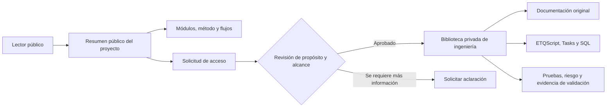

### Estructura interna del repositorio

```text
biblioteca-privada/
├── README.md                         Entrada principal del repositorio
├── docs/                             Catálogos, método, acceso y procedencia
├── library/
│   ├── etqscript/
│   │   ├── formulas/                 Fórmulas pequeñas agrupadas por propósito
│   │   ├── forms/                    On Open, On Refresh, On Save y Shared
│   │   ├── profiles/                 Perfiles de utilidades reutilizables
│   │   └── tasks/modules/            Tasks agrupados por módulo ETQ
│   └── sql/                          Administración, configuración y diagnóstico
├── tools/                            Validación de inventario y documentación
└── archive/                          Evidencia local excluida de publicación
```

### Organización de cada solución

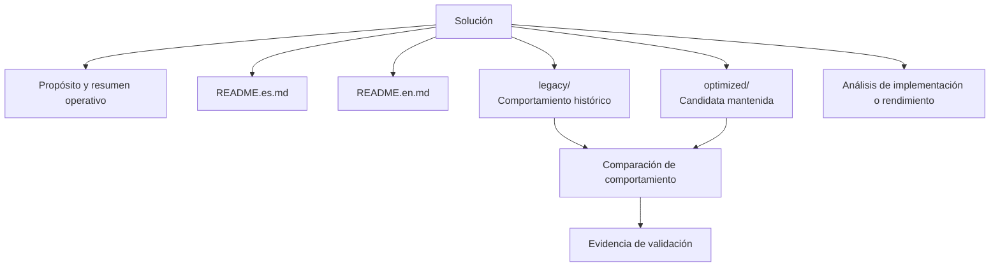

| Área | Significado |
| --- | --- |
| `legacy/` | Conserva la fuente recibida o el comportamiento histórico para comparación y recuperación. |
| `optimized/` | Contiene una candidata mantenida, una prueba controlada o un plan de mejora. No implica aprobación para producción. |
| `README.es.md` | Explica propósito, funcionamiento, configuración, efectos, riesgos y validación en español. |
| `README.en.md` | Proporciona la explicación correspondiente en inglés. |
| `IMPLEMENTATION.*.md` | Registra decisiones de diseño, compatibilidad, cambios deliberados y criterios de aceptación. |
| `PERFORMANCE_REVIEW.md` | Documenta cuellos de botella, volumen, puntos de medición y expectativas de rendimiento. |

## Módulos y soluciones

### Training Management — 10 soluciones

| Solución | Resumen público |
| --- | --- |
| Auto Create Training Assignments | Crea asignaciones usando reglas de aplicabilidad, fuente, revisión, recurrencia y prevención de duplicados. |
| Check In Course Profiles | Revisa y registra Course Profiles mediante un proceso controlado. |
| Disable Course Profiles | Deshabilita perfiles que cumplen criterios administrativos definidos. |
| Disable Profiles with Source Documents | Evalúa relaciones con documentos fuente antes de deshabilitar perfiles. |
| Notify Expired Assignments | Detecta asignaciones vencidas y produce notificaciones controladas. |
| Refresh Completed Assignments | Actualiza asignaciones completadas de acuerdo con reglas de fechas y recurrencia. |
| Role-Based Training Sync | Sincroniza grupos de capacitación utilizando roles y alcance organizacional configurado. |
| Single Course Assignment Test | Permite una validación acotada contra un solo Course Profile. |
| Void Non-applicable Assignments | Identifica y anula asignaciones que dejaron de ser aplicables. |
| Void Recent Assignments | Proporciona un mecanismo de recuperación para asignaciones creadas recientemente. |

### Document Control — 5 soluciones

| Solución | Resumen público |
| --- | --- |
| Bulk Archive | Procesa el archivo de documentos por lotes con selección y reporte controlados. |
| Hard Copy Distribution List | Mantiene información de distribución física durante el ciclo documental. |
| Legacy Hardcopy Migration | Migra información histórica de distribución con prevención de duplicados y planificación de recuperación. |
| Rename Documents | Aplica cambios controlados de nombre a documentos seleccionados. |
| Void Overdue Draft Documents | Identifica borradores vencidos y define una estrategia controlada de reporte o anulación. |

### Administration Center — 2 soluciones

| Solución | Resumen público |
| --- | --- |
| Expiration Date Reminder | Evalúa fechas de expiración y prepara recordatorios administrativos. |
| Release System Locks | Identifica y libera bloqueos documentales administrados por el sistema. |

### Shared Workflow — 2 soluciones

| Solución | Resumen público |
| --- | --- |
| Auto-void Orphaned Action Items | Detecta Action Items sin una relación padre válida y aplica un tratamiento controlado. |
| Route Documents | Encapsula reglas para enrutar documentos a través de workflows configurados. |

### Compliance Obligations — 1 solución

| Solución | Resumen público |
| --- | --- |
| Regulatory Integration Task | Organiza el flujo de una integración externa relacionada con obligaciones regulatorias. |

## Componentes reutilizables

### EtQScript Profiles

| Perfil | Responsabilidad |
| --- | --- |
| Global Script Utilities | Logging, contratos, fechas, campos, DAO, SQL protegido, subformularios, attachments, links, creación documental, guardado y runners. |
| Training Management Utility Functions | Operaciones compartidas para Course Profiles, empleados, aplicabilidad y Training Assignments. |
| Email Helpers | Construcción y envío consistente de correos desde automatizaciones ETQ. |
| ETQ Debug | Diagnóstico controlado y representación de objetos. |
| CURR Sync Helpers | Funciones auxiliares para procesos especializados de sincronización. |
| Sustainability Data Collection | Utilidades para crear y mantener registros de recopilación de datos. |
| Sustainability Definitions | Definiciones compartidas utilizadas por el perfil de recopilación de datos. |

### Fórmulas y eventos de formulario

- Cálculo de diferencias en días hábiles.
- Validación de ubicaciones seleccionadas.
- Acceso a secciones basado en ubicación y fase del workflow.
- Creación y reasignación de Action Items.
- Movimiento de registros dentro de subformularios.
- Fórmulas de Course Profile para `On Open`, `On Refresh`, `On Save` y contexto compartido.

### SQL Server — 21 consultas

| Categoría | Cobertura |
| --- | --- |
| Administración | Acceso por ambiente, usuarios, grupos, membresías, perfiles, ubicaciones y zonas horarias. |
| Configuración | Campos, lookups, sincronización, listas maestras, búsqueda de referencias y workflows. |
| Documentos | Rutas y relaciones de attachments documentales. |
| Diagnóstico | Conteos, comprobaciones de volumen y análisis de solo lectura antes de realizar cambios. |
| SQL asociado a Tasks | Fuentes de datos y diagnósticos que respaldan una automatización específica. |

## Mapa de documentación

La biblioteca privada ofrece distintos niveles de lectura. Una persona puede comenzar con el resumen del repositorio y avanzar gradualmente hacia el módulo, la solución y los detalles de implementación.

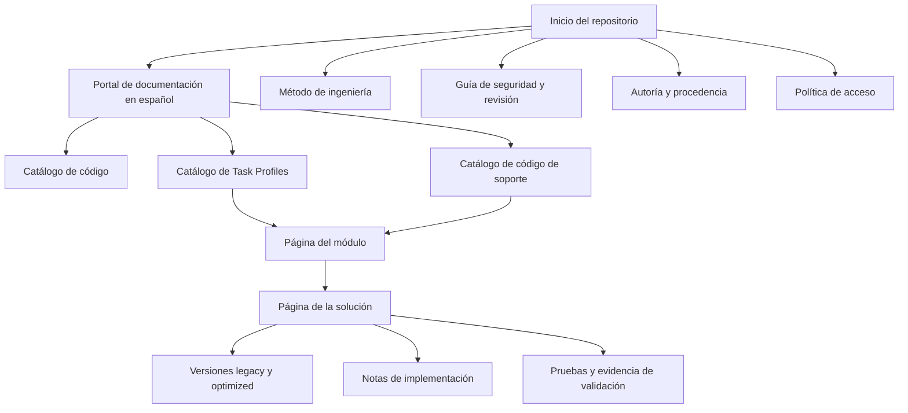

| Página privada | Qué encontrará el lector |
| --- | --- |
| Portal de documentación en español | Navegación recomendada según la necesidad y el tipo de contenido. |
| Catálogo de código en español | Propósito, funcionamiento, configuración, efectos y riesgo de fuentes Python y SQL. |
| Catálogo de Task Profiles | Inventario de Tasks organizado por módulo ETQ y objetivo operativo. |
| Catálogo de código de soporte | Fórmulas, perfiles reutilizables y herramientas de mantenimiento. |
| Método de ingeniería | Proceso utilizado para clasificar, preservar, analizar, optimizar, probar y promover soluciones. |
| Guía de seguridad y revisión | Lista de verificación antes de guardar, enrutar, anular, archivar o modificar registros. |
| Autoría y procedencia | Separación entre documentación original, trabajo optimizado, fuentes legacy y material externo. |
| Política de acceso | Requisitos de solicitud, revisión, alcance mínimo y retiro de acceso. |
| Notas de API e implementación | Contratos de utilidades, decisiones técnicas y compatibilidad esperada. |
| Revisiones de rendimiento | Consultas dominantes, puntos de medición, controles de volumen y criterios de aceptación. |

## Flujos de trabajo

### Ciclo de ingeniería

```mermaid
flowchart LR
    Recepcion["1. Recibir fuente o requerimiento"] --> Clasificar["2. Clasificar módulo, contexto y riesgo"]
    Clasificar --> Preservar["3. Preservar comportamiento legacy"]
    Preservar --> Analizar["4. Analizar reglas, datos y efectos"]
    Analizar --> Optimizar["5. Diseñar candidata mantenida"]
    Optimizar --> Probar["6. Ejecutar pruebas locales y en ETQ"]
    Probar --> Validar["7. Validar en DEV y VAL"]
    Validar --> Aprobar{"8. Aprobación"}
    Aprobar -->|Aprobado| Desplegar["9. Promover versión validada a PROD"]
    Aprobar -->|Requiere cambios| Analizar
    Desplegar --> Observar["10. Observar métricas y resultado"]
    Observar --> Mejorar["11. Registrar lecciones y mejoras"]
    Mejorar --> Analizar
```

### Ejecución típica de un Task

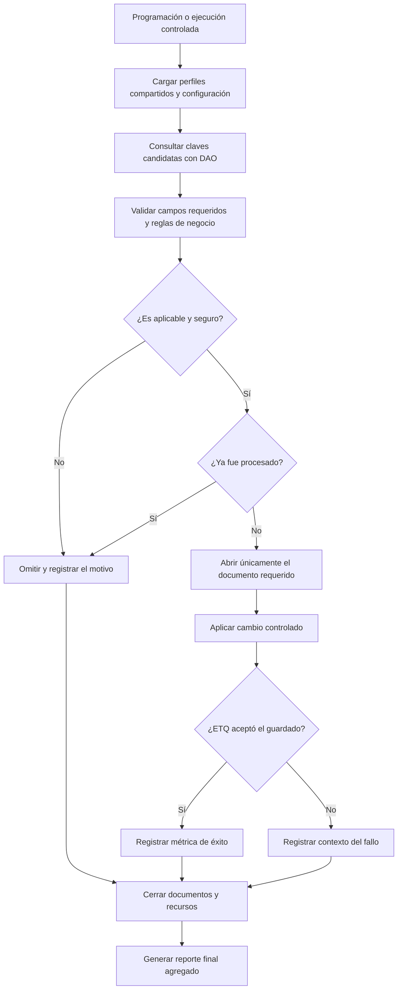

### Promoción de DEV a VAL y PROD

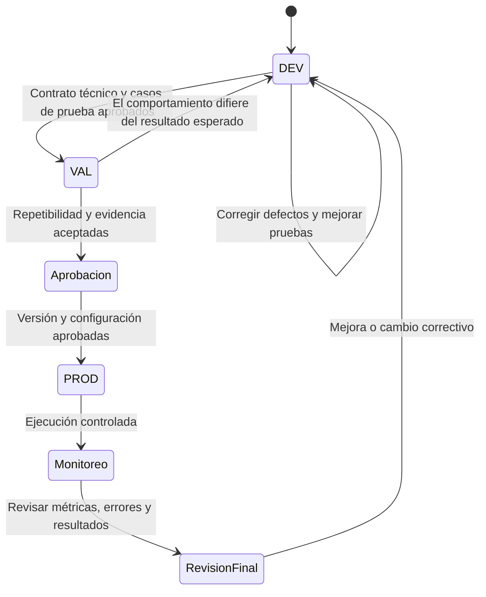

| Ambiente | Objetivo | Evidencia mínima |
| --- | --- | --- |
| DEV | Confirmar el contrato técnico, las reglas de negocio y el manejo de errores. | Casos positivos, negativos, límites, fallos y logs. |
| VAL | Demostrar repetibilidad con una configuración equivalente. | Comparación con legacy, resultados esperados y aprobación. |
| PROD | Ejecutar exactamente la versión aprobada bajo controles operativos. | Versión, parámetros, inicio y fin, métricas, excepciones y resultado final. |

### Flujo de acceso a la documentación

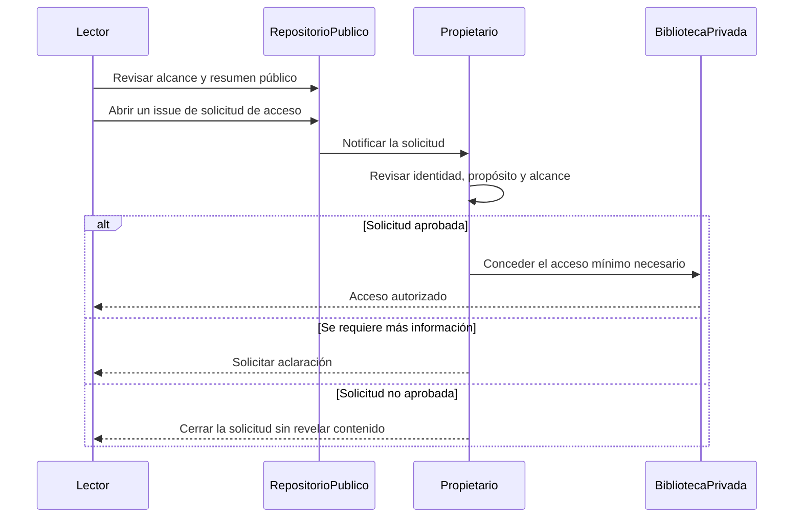

## Casos de estudio representativos

### Auto Create Training Assignments

Automatización de alto volumen utilizada para estudiar aplicabilidad, prevención de duplicados por fuente y revisión, consultas en bloque, listas SQL acotadas, apertura tardía de documentos y métricas de rendimiento.

### Global Script Utilities

EtQScript Profile centralizado para estandarizar logging, validación, fechas, acceso a campos, operaciones DAO, SQL protegido, subformularios, attachments, links, creación documental, guardado y cierre confiable.

### Role-Based Training Sync

Patrón de sincronización que combina pertenencia a grupos, alcance por ubicación, actualizaciones aditivas e idempotencia para evitar reemplazos innecesarios de campos multivalor.

### Legacy Hardcopy Migration

Ejemplo de migración controlada con selección DAO-first, detección de duplicados, validación previa a creación, métricas por etapa y planificación de recuperación.

## Principios de ingeniería

| Principio | Aplicación |
| --- | --- |
| Idempotencia | Repetir una ejecución no debe crear duplicados ni degradar datos. |
| Fallo seguro | Si una validación crítica no puede completarse, el cambio no se realiza. |
| Selección DAO-first | Primero se seleccionan las claves candidatas y después se abren únicamente los documentos necesarios. |
| Recursos acotados | Se controlan el volumen, las listas SQL `IN`, la materialización de filas y la frecuencia de logs. |
| Observabilidad | Se registran contadores, tiempos, motivos de omisión y errores accionables. |
| Cierre garantizado | Los documentos y recursos abiertos se cierran incluso cuando ocurre una excepción. |
| Configuración explícita | Los IDs, nombres de diseño, límites y opciones dependientes del ambiente se identifican claramente. |
| Evidencia antes de PROD | Una candidata no se promueve únicamente porque compila o parece más rápida. |

### Qué significa “optimized”

Una versión `optimized` intenta mejorar rendimiento, claridad, seguridad u observabilidad preservando el comportamiento de negocio esperado. Continúa siendo una candidata hasta completar sus pruebas, comparación y aprobación.

## Autoría y límites

### Trabajo original del proyecto

Los siguientes elementos son trabajo técnico y editorial original producido para este proyecto:

- Arquitectura del repositorio y organización por módulos.
- Explicaciones funcionales y guías operativas.
- Análisis de riesgo y efectos sobre los datos.
- Comparaciones entre `legacy` y `optimized`.
- Propuestas de rendimiento y observabilidad.
- Planes de prueba, criterios de aceptación y guías de recuperación.

### Límites

- Este repositorio público no contiene código privado ni configuración interna.
- Los manuales del proveedor no se publican ni se presentan como trabajo propio.
- El código histórico externo se identifica como `legacy` y conserva su procedencia.
- No se publican datos personales, credenciales, rutas internas ni información de producción.
- Nada de lo incluido sustituye la documentación, capacitación, licencia o soporte oficial del proveedor.
- Ninguna implementación debe considerarse lista para producción sin validación independiente.

## Solicitar acceso

La biblioteca completa de ingeniería es privada. Cada solicitud se revisa individualmente y el acceso se concede con el alcance mínimo necesario.

Incluya únicamente:

1. Su usuario de GitHub.
2. El propósito de la solicitud.
3. El módulo o tema requerido.
4. El uso previsto de la información.
5. La confirmación de que no redistribuirá contenido restringido.

[**Abrir un issue de solicitud de acceso →**](https://github.com/yorzethmc/etq-reliance-automation-overview/issues/new)

> No incluya información confidencial, datos personales, configuración interna ni detalles de producción en un issue público.

---

## Aviso de independencia

ETQ, ETQ Reliance y Octave Reliance son nombres y marcas de sus respectivos propietarios. Este proyecto independiente no está afiliado, respaldado ni sustituye la documentación, capacitación, licenciamiento o soporte oficial del proveedor.
